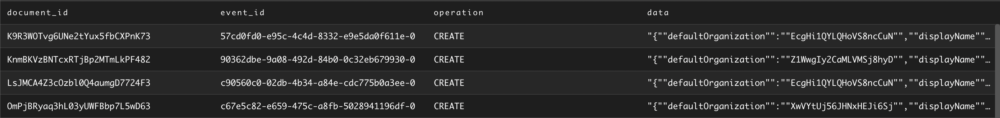
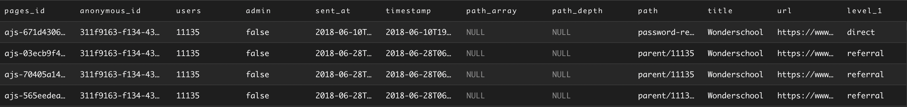
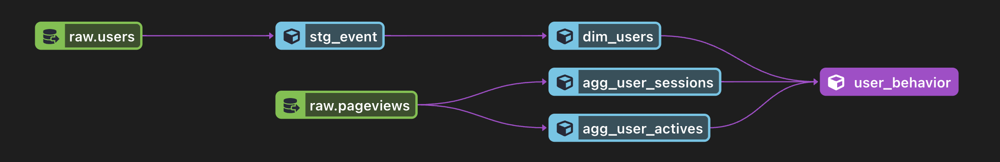

# dbt-test

The two tables were provided to create a user_behaviour table.

### Users table 
 Table with user data
 
 

### Pageviews table 
 Table with historical pageview data
 
 

### User_behaviour view
View that consolidates agg_user_actives and agg_user_sessions aggregated by each user id. Here is an overview of the transformation pipeline for the user_behaviour
 
* user_id - unique user_id
* active_last_14 - 14 days activity check value derived from ‘timestamp’ column 
* active_last_30 - 30 days activity check value derived from ‘timestamp’ column
* session_count - Distinct count of ‘anonymous_id’ assumed to be session_id
* total_touches - Count of each page view row assumed to be each link visited
* first_touch_date - first day user shows up in the page views table
* first_touch_url - first link visited by user

 
 
